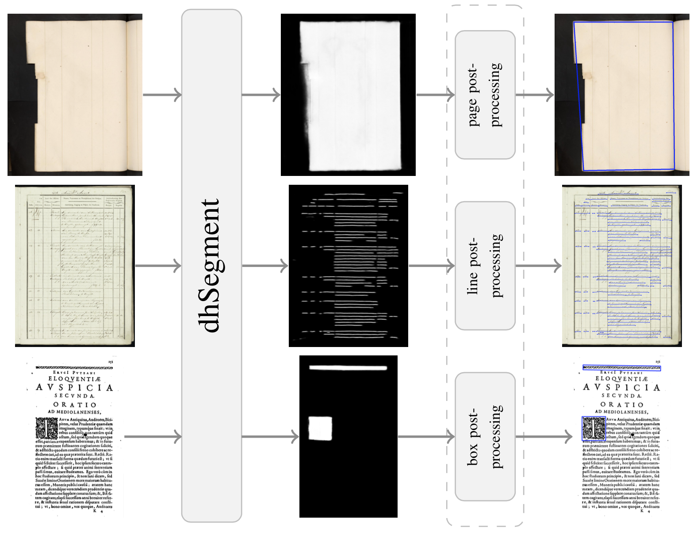
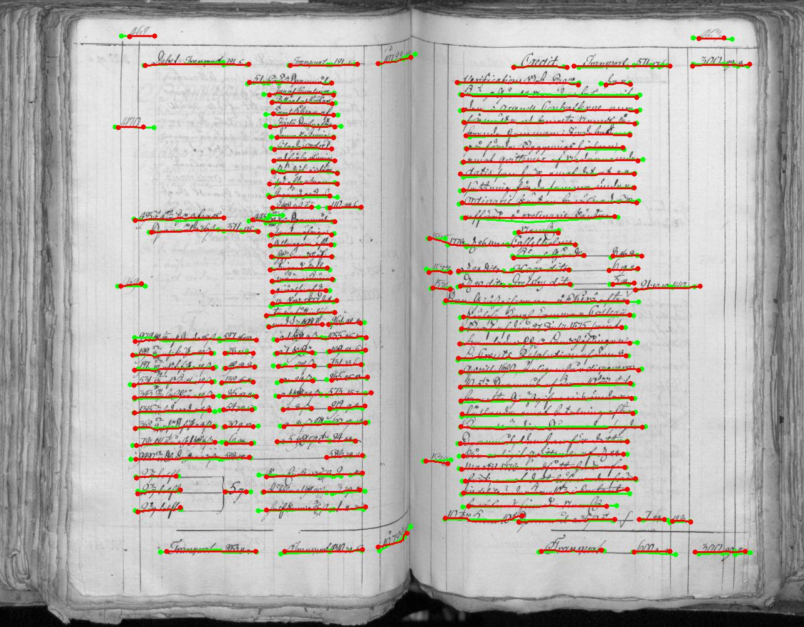

# What is dhSegment?

{: .center-image .w-70}

It is a generic approach for Historical Document Processing. It relies on a Convolutional Neural Network to do the heavy lifting of predicting pixelwise characteristics. Then simple image processing operations are provided to extract the components of interest (boxes, polygons, lines, masks, ...)

It was originally created by [Benoit Seguin](https://twitter.com/Seguin_Be) and Sofia Oliveira Ares at the DHLAB of EPFL for the needs of the Venice Time Machine.

It does include the following features: 

- You only need to provide a list of images with annotated masks, which everybody can do with an image editing software (Gimp, Photoshop). You only need to draw the elements you care about!

- Allows to classify each pixel across multiple classes, or even multiple labels per pixel.

- On-the-fly data augmentation, and efficient batching of batches.

- Leverages a state-of-the-art pre-trained network (Resnet50) to lower the need for training data and improve generalization.

- Monitor training on Tensorboard very easily.

- A list of image processing operations are already implemented such that the post-processing step only take a couple of lines.

# What sort of training data do I need?

Each training sample is an image of a document with the corresponding parts to be predicted.

<div style="margin:0 auto; width: 80%;">
    <image src="assets/images/cini_input.jpg" style="width: 48%;"></image>
    <image src="assets/images/cini_labels.jpg" style="width: 48%;"></image>
</div>

Additionally, a text file encoding the RGB values of the classes has to be present, in this case if we want background, document, photograph to be respectively classes 0, 1, and 2 we need to encode their color line-by-line:

```
0 255 0
255 0 0
0 0 255
```


# Use cases

## Page Segmentation

{: .center-image .w-50}

## Layout Analysis

<div style="margin:0 auto; width: 80%;">
    <image src="assets/images/diva.jpg" style="width: 45%;"></image>
    <image src="assets/images/diva_preds.png" style="width: 45%;"></image>
</div>

## Ornament Extraction

{: .center-image .w-50}

## Line Detection

{: .center-image .w-70}

## Document Segmentation

{: .center-image .w-70}

# Tensorboard Integration

{: .center-image .w-70}
{: .center-image .w-70}
{: .center-image .w-70}
